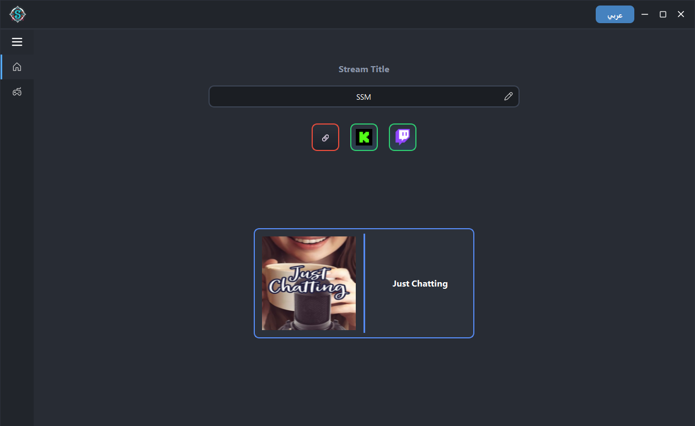
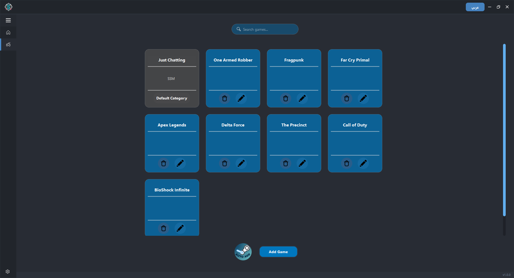
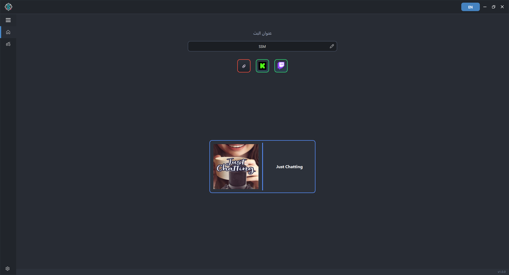
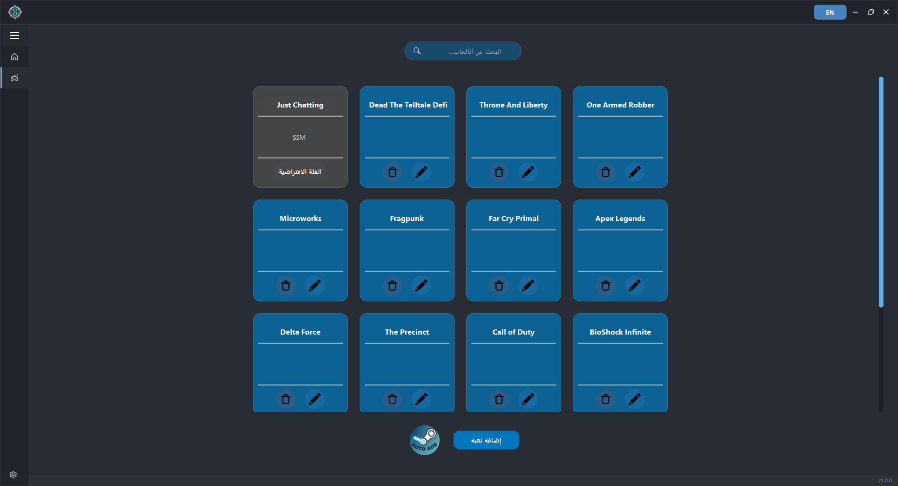
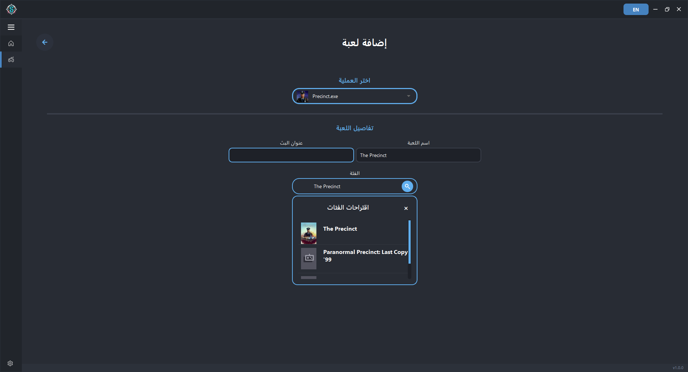
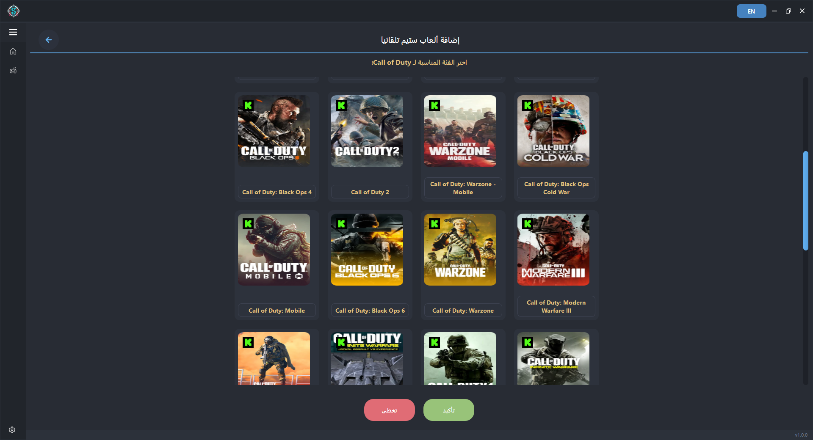

# 🖥️ SHKAS STREAM MANAGER
📜 This README is available in both English and Arabic.

📜 هذا الملف متاح باللغتين الإنجليزية والعربية — <a href="#-shkas-stream-manager-ar">اضغط هنا لرؤية الشرح ب اللغة العربية ⬇️</a>

---

## 💡 Program Idea

The app’s idea is to automatically change the stream category and title on the **Twitch** and **Kick** platforms according to the game currently running.

---

## ⚙️ How the App Works

### 1️⃣ Home Page

On this page, you can:
- Manually edit the stream title for both platforms at once.
- View the current status.

---

### 2️⃣ Game Management Page

On this page, you can:
- Manage the list of games that the app tracks.
- Add or remove tracked games.
- The stream category and title will update automatically based on these games.

---

### 3️⃣ Manually Adding Games

You can manually add games by:
- Selecting the game’s process (the game must be running).
- After selecting the process, the game name and category will be automatically detected and suggestions will appear.
- Choose the appropriate category.

---

### 4️⃣ Automatically Add Steam Games

You can also automatically add games installed via **Steam**:
- Click the **“Add Steam Games”** icon.
- You'll be taken to a new page where the app:
  - Scans your installed Steam games.
  - Detects the correct category if available.
  - Allows you to choose from similar categories if there are multiple options.

---

## 📥 Download Latest Version

👉 [Click here to download the latest release](https://github.com/iiSHKAS/SHKAS-STREAM-MANAGER/releases)

---

## 🇸🇦 SHKAS STREAM MANAGER (ar)

---

## 💡 فكرة البرنامج

فكرة البرنامج هي تغيير عنوان البث وتصنيفه تلقائيًا على منصات **Twitch** و**Kick** بناءً على اللعبة المشغّلة حاليًا.

---

## ⚙️ طريقة عمل البرنامج

### 1️⃣ الصفحة الرئيسية

في هذه الصفحة يمكنك:
- تعديل عنوان البث يدويًا لكلا المنصتين مرة واحدة.
- مشاهدة حالة البث الحالية.

---

### 2️⃣ صفحة إدارة الألعاب

في هذه الصفحة يمكنك:
- إدارة الألعاب التي يراقبها البرنامج.
- إضافة أو إزالة الألعاب المتابعة.
- سيتم تحديث التصنيف والعنوان تلقائيًا بناءً على اللعبة المشغلة.

---

### 3️⃣ إضافة الألعاب يدويًا

يمكنك إضافة الألعاب يدويًا عن طريق:
- اختيار عملية اللعبة (يجب أن تكون اللعبة قيد التشغيل).
- بعد تحديد العملية، سيتم تحديد اسم اللعبة والتصنيف تلقائيًا، وستظهر اقتراحات للتصنيف.
- اختر التصنيف المناسب.

---

### 4️⃣ إضافة ألعاب Steam تلقائيًا

يمكنك أيضًا إضافة ألعاب Steam المثبتة تلقائيًا عبر:
- النقر على ايقونة زر ستيم في صفحة ادارة الالعاب
- سيتم نقلك إلى صفحة جديدة حيث:
  - يتم فحص الألعاب المثبتة.
  - يتم تحديد التصنيف المناسب إن وجد.
  - قد تظهر لك عدة تصنيفات مشابهة لاختيار الأنسب.

---

## 📥 تحميل آخر إصدار

📎 [اضغط هنا لتحميل آخر نسخة من البرنامج](https://github.com/iiSHKAS/SHKAS-STREAM-MANAGER/releases)
