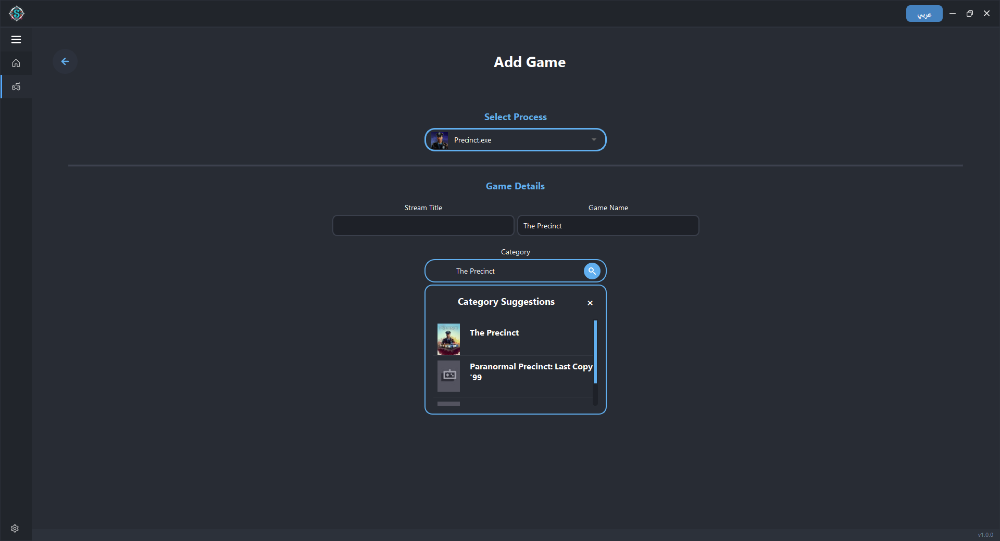
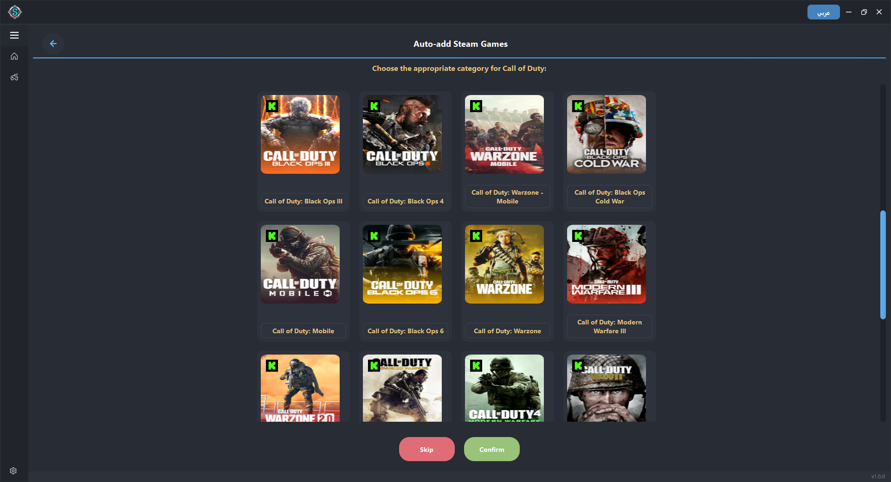

# 🎮 Auto Stream Category & Title Updater

A tool that automatically updates your stream's **category** and **title** on both **Twitch** and **Kick**, based on the game currently running on your system.

---

## 💡 Program Idea

The program’s idea is to automatically change the stream category and title on the **Twitch** and **Kick** platforms according to the game currently running.

---

## ⚙️ How the Program Works

### 1️⃣ Title & Status Page

On this page, you can:
- Manually edit the stream title.
- View the current stream status and platform.

🖼️ *Image Placeholder:*  

---

### 2️⃣ Game Management Page

On this page, you can:
- Manage the list of games that the program tracks.
- Add or remove tracked games.
- The stream category and title will update automatically based on these games.

🖼️ *Image Placeholder:*  

---

### 3️⃣ Manually Adding Games

You can manually add games by:
- Selecting the game’s running process (the game must be running).
- Searching for the correct category.
- Choosing the most accurate one.

🖼️ *Image Placeholder:*  

---

### 4️⃣ Automatically Add Steam Games

You can also automatically add games installed via **Steam**:
- Click the **“Add Steam Games”** button.
- You'll be taken to a new page where the program:
  - Scans your installed Steam games.
  - Detects the correct category if available.
  - Allows you to choose from similar categories if there are multiple options.

🖼️ *Image Placeholder:*  

---

## ✅ Features

- Automatic stream category & title updates.
- Supports both Twitch and Kick platforms.
- Manual and automatic game tracking.
- Steam integration.

---

## 📂 Image Folder Structure

Make sure your images are stored in the following folder:
